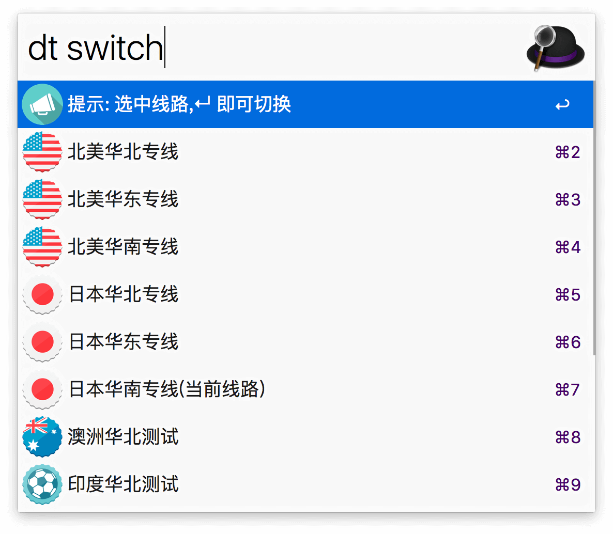

#AlfredWorkflow-DuoTai-Helper

> 一个[多态ZPN](https://duotai.org/) 的助手管理型Alfred Workflow。可通过本Workflow 直接查看账户信息，切换线路，开关某些模式。使用Python 语言编写( python2 )，支持最新的Alfred 3。

## 下载

[下载地址](http://https://github.com/Jeff2Ma/AlfredWorkflow-DuoTai-Helper/releases)

## 使用方法

- 下载安装，通过关键词`dt`激活使用（截图隐藏部分敏感内容）：

- 一些选项可以通过回车（Enter）二次激活使用：

运行后会有提示：

- 初次使用需要你输入你的多态账号信息（邮箱，密码），存储和获取账户密码均通过系统keychain 进行，提高安全性：

  回车后按照说明进行输入即可：

## 使用须知

- 使用本Workflow 前请确保你的Alfred APP 的Powerpack 功能已经解锁。

- 须为多态付费用户，且为** Basic **套餐（因为我没有PRO 套餐所以不知道其API）。

- 确保已经安装 [requests](http://docs.python-requests.org/zh_CN/latest/index.html) 库。

## 原理

有兴趣请直接看代码，基本原理是通过模拟登录获得 cookie，然后调用网站本身的Restful API 来实现数据的获取（get）与更新（put）。

## 排查

如果不能正常运行，可以通过如下方式查看输出的信息进行排查：

## 鸣谢

- 强大的第三方[Python Alfred 库](http://www.deanishe.net/alfred-workflow/index.html) 

- 一个[类似的插件](http://www.packal.org/workflow/apple-account-switcher)带来的灵感

## 意见反馈

如果有意见反馈或者功能建议，欢迎创建 Issue 或发送 Pull Request，感谢你的支持和贡献。