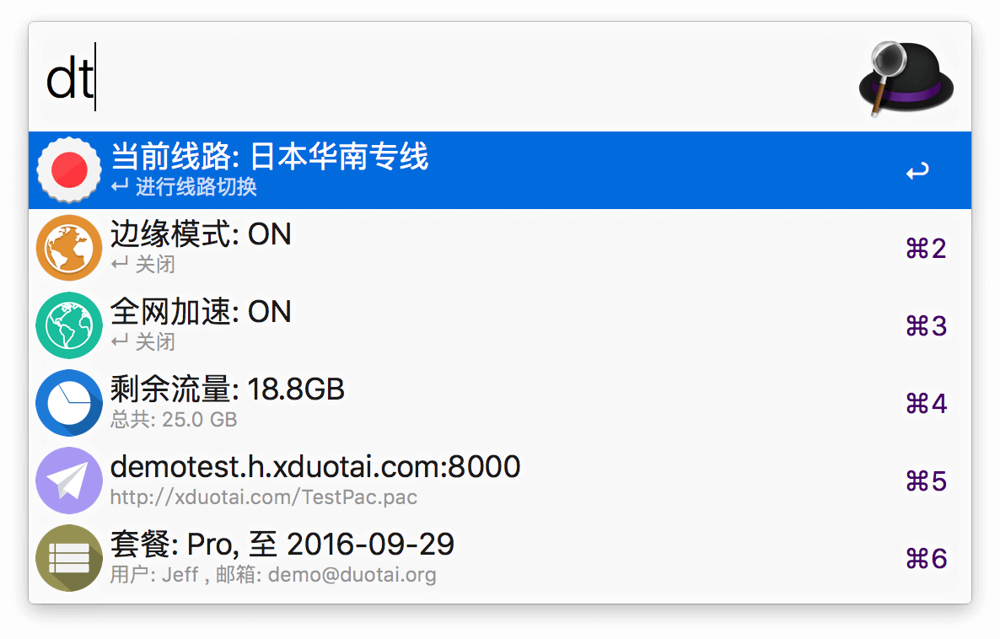
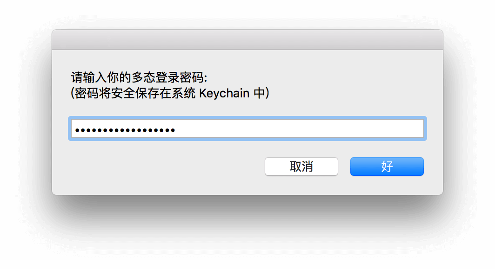
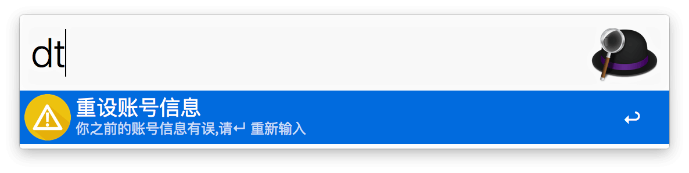

#AlfredWorkflow-DuoTai-Helper

> 专为科学上网服务[多态ZPN](https://duotai.org/) 开发的一个助手管理型[Alfred](https://www.alfredapp.com/) Workflow。可通过本 Workflow 可以直接查看账户信息，切换线路，开关某些模式。使用 Python 语言编写( python2 )，支持最新的 Alfred 3。

## 功能与特色

- 直接通过Alfred 搜索框直接前端显示多态账户信息；

- 可以直接切换线路，开关某些模式，免除来回多次打开网页登录的麻烦；

- 可以一键复制PAC 文件、代理连接信息到系统剪贴板；

- 可以一键将PAC 文件路径保存在系统网络的自动代理配置中；

- 存储和获取账户密码均通过系统keychain 进行，提高安全性；

- 轻量级，不用下载官方臃肿的客户端；

- 本 Workflow 支持自动更新。

## 下载

[下载地址](http://https://github.com/Jeff2Ma/AlfredWorkflow-DuoTai-Helper/releases)

## 使用方法

- 下载安装，通过关键词`dt`激活使用（截图隐藏部分敏感内容）：

- 一些选项可以通过回车（Enter）二次激活使用：

运行后会有提示：

- 初次使用需要你输入你的多态账号信息（邮箱，密码）：

  1）回车后按照说明进行输入即可：

  2) 首次输入账号信息后第一次会检验账号信息是否正确（通过能否正常登录判断），如果没有会提示重设账号信息：
  
  
  
## 高级用法

### 复制代理信息，PAC 文件路径

### 配置PAC 文件路径到系统的自动代理配置中

### 查看Keychain 中保存的账户信息

在Alfred 中输入`keychain` 打开“钥匙串访问”应用，关键词搜索`duotai`即可：

## 使用须知

- 使用本Workflow 前请确保你的Alfred APP 的Powerpack 功能已经解锁。

- 须为多态付费用户，Basic 套餐用户使用最佳（因为我没有PRO 套餐所以不知道其 API是否有区别）。

- 确保已经安装 [requests](http://docs.python-requests.org/zh_CN/latest/index.html) 库:

		pip install requests

- 由于多态官方并没有公开此API，所以不确保本workflow 能一直正常工作。但可以确定的是：在你看到这段文字的时候本 workflow 依然处于保持更新状态。

## 原理

有兴趣请直接看代码，基本原理是通过模拟登录获得 cookie，然后调用网站本身的RESTful API 来实现数据的获取（get）与更新（put）。

## 排查

如果不能正常运行，可以通过如下方式查看输出的信息进行排查并反馈：

## 鸣谢

- 强大的第三方[Python Alfred 库](http://www.deanishe.net/alfred-workflow/index.html) 

- 一个[类似的插件](http://www.packal.org/workflow/apple-account-switcher)带来的灵感

## 意见反馈

如果有意见反馈或者功能建议，欢迎创建 Issue 或发送 Pull Request，感谢你的支持和贡献。

## 更新历史

### V1.0.0 - 2016.08.28

- 发布公开版本